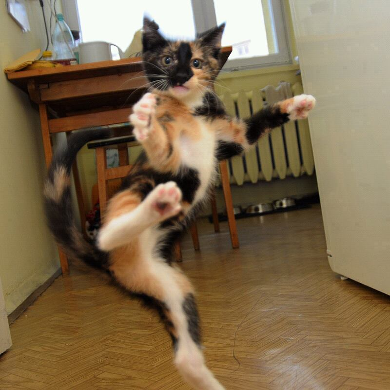

# Change the Cat!

###### This cat photo was last changed by [@IT24100762](https://github.com/IT24100762) on Fri Aug 29 2025 08:34:25 GMT+0000 (Coordinated Universal Time).

[![Change Cat]][Link]

[Change Cat]: https://img.shields.io/badge/Click_here_to_change_the_cat-37a779?style=for-the-badge
[Link]: https://github.com/Saviru/change-the-cat/issues/new?template=meow-.md

## How to get a new cat?

Create a new issue with the title "Meow!" and our workflow will automatically change the cat photo!

 

**Note:** *This will take a few seconds/minutes to update the cat photo.* Meow!😸 

  

Developed and maintained by [@Saviru](https://github.com/Saviru)
  

Made with ❤️ for the GitHub community 
 
